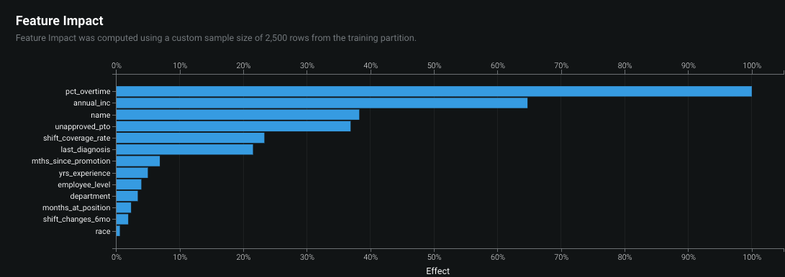
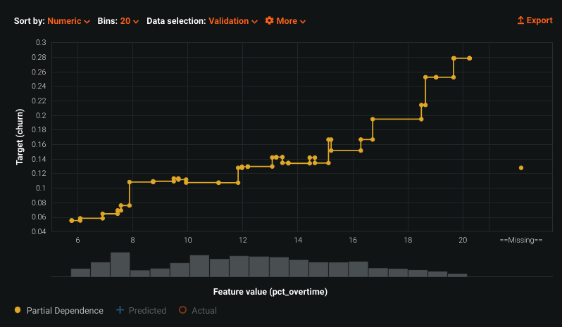
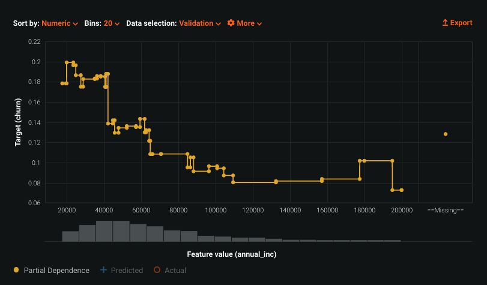
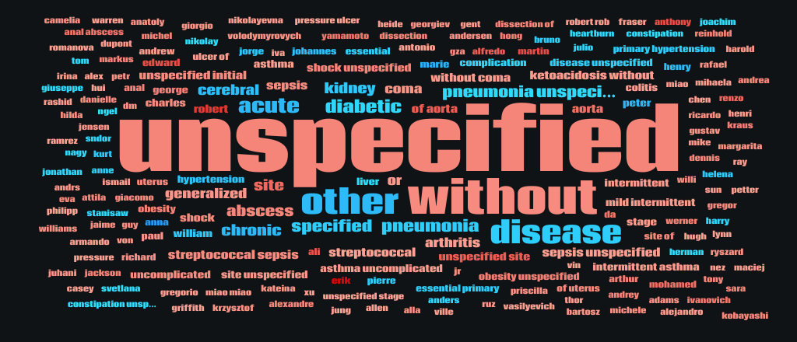
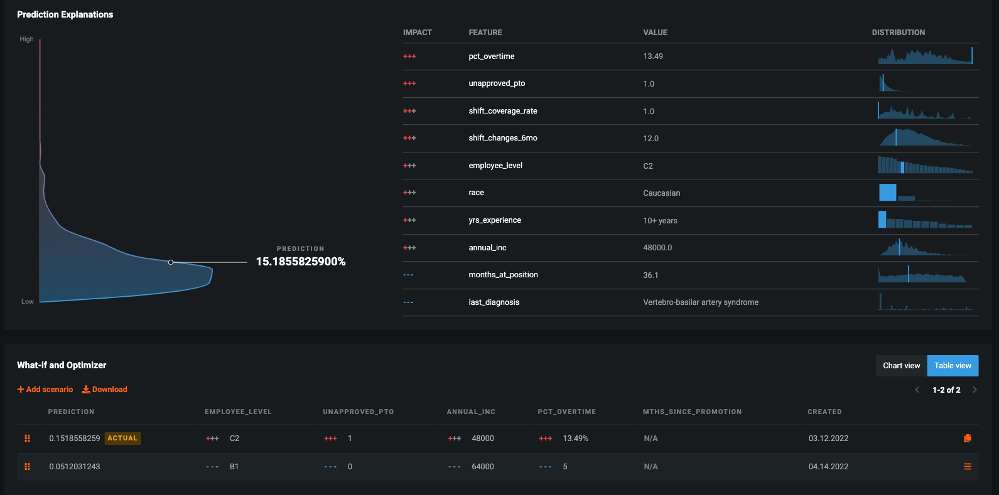

# Staffing Churn (a.k.a. Nurse Attrition)

## Overview

Staff churn (which is usually around 5%) at a health care facility directly impacts the quality of patient care and efficency. It can lead to an unexpected lack of diversity and increased cost of care. These issues can result in regulatory fines, damage to the facility's brand name, and a potential impact to market share.

The number one factor causing nurses to leave their job is <b>culture</b>. There is plenty of demand; nurses are constantly recruited, and the pay is very standardized. Most facilities are already aware of this issue and yet the rate is still around 5%. This is an excellent opportunity for an ML-based solution that can help them identify the nurses most likely to leave and help them understand why to potentially reverse that decision.

### What problem are we trying to solve?

In general, staff attrition is a scourge across multiple departments within a large provider. It may include OR nurses, physicians, EMT’s, and other staff. Typically we recommend splitting use cases so that the model can identify insights specific to that employee group.

Nurse attrition was already impacting providers before COVID. The pandemic has only exacerbated an already-hectic situation that has pushed and stretched nurses even further. The main reason nurses leave (it's not salary) is the culture around the hospital, clinic, etc. COVID was an additional level of stress.

The demo provided here address a specific type of employee: the hospital nurse. It can be modified to address any of the staffing categories found at a health provider, including home health (i.e. travel nurses), hospice, etc.

### What is the value to the customer?

The monthly churn rate in nursing is around 4-5%. The average cost to replace a nurse is $20,000, including costs to find and train replacements. Our prospects would see quick, tangible valued from a solution that could a) estimate churn so they can get a jump on hiring, b) gain insights as to what systemic issues are contributing to attrition and c) generate dashboards for managers to know where to concentrate to retain staff.

This solution could generate annual savings of $400 *per nurse*. Non-tangible benefits include improved nurse satisfaction, translating to improved efficiency and quality of patient care.
*(Assumptions: 4% monthly churn rate, assume we can prevent half of those. Which saves $20,000 for 2% assuming each nurse could churn once a year).*

### What are we trying to predict?

Ultimately we are trying to predict if an employee is still employed at the end of a monitoring window (typically a 30 day, or monthly, window). This is a binary classification and the target value should be churn (1) or not-churned (0). Not-churn indicates the employee is still employed at the end of an observation window. The period of 30 days may seem too short to some customers. They require enough time to take action and be able to retain staff who is likely churning, so 60 or 90 days may be preferable. 

### How does DataRobot help?

- Connects to your data and determines which data sources are relevant and visualizes the contribution to accuracy and the relationship between each column and churn.
- Automatically builds a bespoke model from your employment data and makes that solution available for monthly employee assessments. 
- Automatically evaluates models for bias & fairness so that you are promoting diversity while keeping your best employees.
- Makes it easy to send alerts to managers with simple & actionable explanations that allow them to have the right conversations with the right employees.

## Data & Features

The shape of the data should be one record per employee, per time period. The target will be based on employee status at the end of the period and the prediction point should be the first day of the period. We will want to create multiple models if the customer is trying to predict churn for different types of employees (i.e. nurses, home health nurses, doctors, staff, etc...). 

Data usally comes from one of the following sources:

- Historical employment with term datesEmployee requests, such as vacation, with approval/deny
- HR records which may contain pay levels, adjustments, tenure (may need to be calculated), etc.
- Team records / reviews and staffing levels
- Patient satisfaction notes
- Daily transactions that describe the workload of the employee
- Employee training history
- Employee manager history

There will be multiple rows per employee. Running as OTV should remove any confusion or target leakage. 

## Models & Insights

### Recommended model settings

Unless you're running one time period (the attached demo data is simulated and only has one), it's very likely you'll set this up as OTV. Make sure you take out things like employee ID, name, etc. if they are included in Informative Features. The training data should span multiple time periods with employees showing up in several batches.
The need to show Bias/Fairness here is medium. Most employers like to think they have a diverse workforce, so setting churn as the "positive" outcome for bias/fairness should allow you to illustrate this concept. However, this is mostly intangible and there aren't any serious fines for a model used internally such as this one.

### What are some of the key insights identified?

The insights from the demo project are designed to match expected outcomes that have been observed at our customers. Be on the lookout for these with your own customer, but realize the pattern might not be an exact match... Insights must be digestible to someone “who only has a minute.” Clinician leadership may or may not have an analytics background but they are busy and “here to care for patients” - they don’t need all the details, they need transparency.

- Pay is rarely the driving factor of churn. Most of the decisions are based on culture and feeling appreciated. 
- Change is a constant for nurses as they can see a variety of cases day-to-day. But certain kinds of change may be perceived negatively - DataRobot helps *calculate* the change and *predict the reaction* at the individual level.
- The word cloud which is composed of the last 30 days of visit types can be very illustrative of how the type of work affects morale.
- Monitoring of churn (i.e. month-over-month) is important because conditions change, and certain feelings or resentments may build up over months. 
- Many of the actions managers can take are very simple and don’t cost anything… *if you know who to talk to and what to say*.

### Model Interpretation 

Below are some examples from the project based on raw data. They are meant for illustration only. Your customer can expect similar insights but avoid making guarantees. The below are included as examples that should resonate with the business and earn trust on the rest of the model's insights.

Sample feature impact. 

Example effect of overtime worked (direct relation to churn):

Example effect of income (indirect relationship with target):

Sample wordcloud - meant to show effect of work type on churn:

## Results

Logloss and AUC will confirm if you have a signal and the profit matrix is a non-starter. Since the value of a successful reversal of churn is $20,000, it will probably tell you that everybody should be treated as potential churn. The most practical metric to look at is "rate at top 10%". 

### Threshold analysis and other metrics

The profit matrix will show that you should talk to all of your employees and make them feel valued. Customers don't need gradient boosting to tell them that. The key value prop of this use case is to show how managers can use the model to gain employee-level insights to focus on the employees who are most likely to leave. Figure a manager can have a limited number of these directed conversations per month (or quarter, etc.).

### How is the model consumed?

To reverse a likely churn, we want to deliver insights to managers. The explanations are very important and they must be actionable and come at a fairly low-cost. Customers can't pay 2x the going rate and be profitable. During the demo it's important to show how the explanations are generated. 

Then, when you show them the AI App you built off the deployment they should recognize the explanations you showed earlier.

### How important is monitoring?

MLOps is a key factor here. We will be updating churn predictions on employees (and scoring new employees) often. A deployment will make the periodic scoring easier to schedule and also make the AI App available as a potential dashboard for a manager. 

As the demands on nurses change due to COVID, unemployment rates, and other health trends, it's likely the model will become less effective. As a customer acts on this recommendation, the churn rate may decrease and the likely culprits of new churn may evolve. Data drift and accuract are important to monitor. 

Defintely show them how a manager could access details on an employee through AI Apps, determine the likely churn drivers, and even run what-if such as "if I decrease Maria's overtime by 5% what effect should that have?".

Example of Manager dashboard + what-if for one employee:

## Demo Resources
Note: you can build a project with the attached dataset. If you'd like access to one of the already-built resources, please send a request to joseph.blue@datarobot.com.

- [Simulated raw dataset](nurse_staffing_training.csv)
- Paxata project - https://datarobot.paxata.com/#/project/e5dbebf1da014bdc8a80bd30d5d16f36/ds-e5dbebf1da014bdc8a80bd30d5d16f36/steps 
- [Google slides for project setup](https://docs.google.com/presentation/d/1LBeOEyvR0F1S3VC5VnFglOsoOH_jhGektyociy1qxOY/edit?usp=sharing)
- Completed project with feature discovery and models deployed https://app.datarobot.com/projects/622cf055e57f001f4250647a/models 
- Active Deployment w/ Monitoring - https://app.datarobot.com/deployments/622cf6adb8ae7bcb075eb0b2/overview 
  - Challengers
  - Fairness monitoring + active humility rules
  - Actively monitoring service/drift/accuracy
- AI what-if Application - https://app.datarobot.com/applications/622cfb36c441c6b2ad8c05ca/ 
  - Simulate how information could be delivered to a manager for follow-up
- Twelve-minute walk-through of demo: https://drive.google.com/file/d/1D9yTsBrgtu_v10RPElAjz2O1JEG3Y1ih/view?usp=sharing
